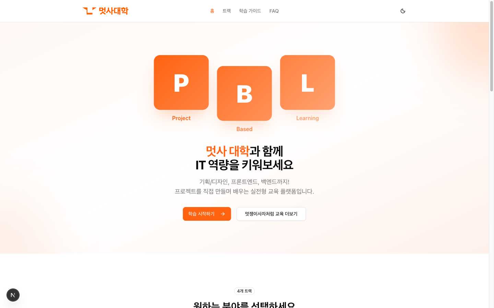
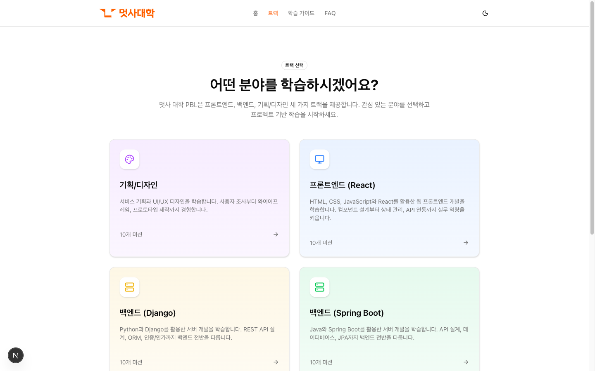
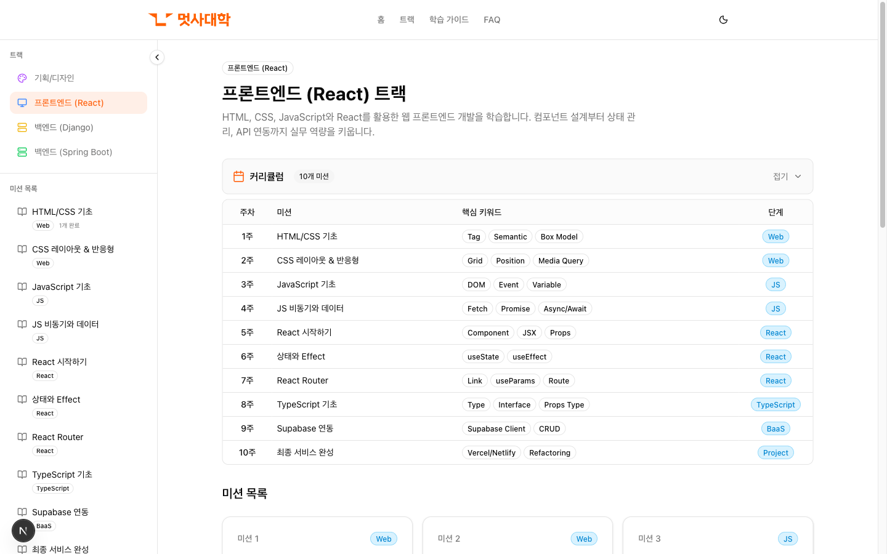
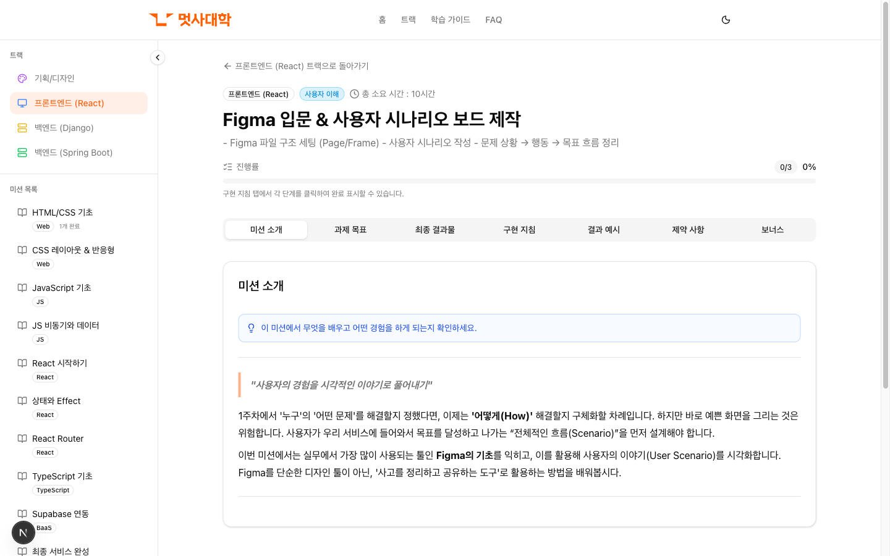
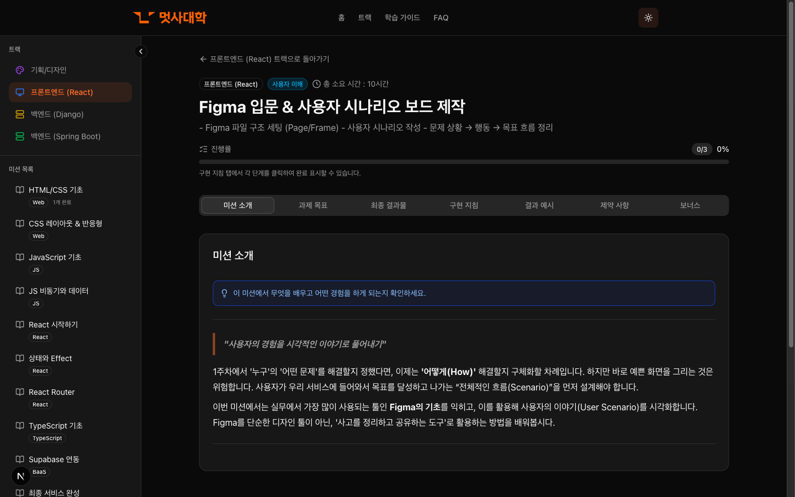

# 멋쟁이사자처럼 PBL

> 프로젝트 기반 학습(Project-Based Learning) 플랫폼

## 소개

멋사 대학 PBL은 프론트엔드, 백엔드, 기획/디자인 분야의 실전형 교육 플랫폼입니다.
프로젝트를 직접 만들며 배우는 **10주 커리큘럼**을 제공합니다.

## 주요 기능

### 트랙 선택

4개 트랙 중 관심 분야를 선택하여 학습을 시작할 수 있습니다.

- **프론트엔드 (React)** - HTML/CSS부터 React, TypeScript까지
- **백엔드 (Spring Boot)** - Java, Spring, JPA 기반 서버 개발
- **백엔드 (Django)** - Python, Django, DRF 기반 서버 개발
- **기획/디자인** - 서비스 기획부터 UI/UX 디자인까지

### 커리큘럼 표

주차별 미션과 핵심 키워드를 한눈에 확인할 수 있습니다.

### 미션 상세

각 미션의 목표, 구현 지침, 결과 예시를 단계별로 안내합니다.

| 라이트 모드 | 다크 모드 |
|------------|----------|
|  |  |

- 섹션별 탭 UI (미션 소개, 과제 목표, 구현 지침 등)
- 진행률 체크리스트
- 다크모드 지원

## 기술 스택

| 분류 | 기술 |
|------|------|
| Framework | Next.js 16 (App Router) |
| Language | TypeScript, React 19 |
| Styling | Tailwind CSS v4 |
| UI Components | shadcn/ui |
| State | Zustand |
| CMS | Notion API |
| Deployment | Vercel |

## 라이선스

© 2026 LIKELION UNIV. All rights reserved.
